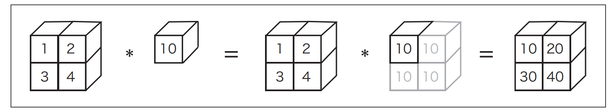
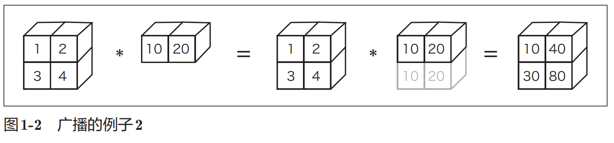

# python 入门

## 数据类型
- 数据类型表示数据的性质，有整数、小数、字符串等类型

- 用 ```type()``` 来查看数据类型

- ``` python
  >>> type(10)
  <class 'int'>
  >>> type(2.718)
  <class 'float'>
  >>> type("hello")
  <class 'str'>
  ```

### 变量

- 可以用字母等定义变量，并进行计算赋值

- 动态类型语言，变量类型根据情况自动决定
- 变量会自动类型转换

- ```  python
  >>> y=3.14
  >>> x=100
  >>> type(x * y)
  <class 'float'>
  ```


### 列表

- 切片访问法

- ``` python
  >>> print(a)
  [1,2, 3, 4, 99]
  >>> a[0:2] # 获取索引为 0 到 2 （不包括 2 ！）的元素
  [1,2]
  >>> a[1:] # 获取从索引为 1 的元素到最后一个元素
  [2,3, 4, 99]
  >>> a[:3] # 获取从第一个元素到索引为 3 （不包括 3 ！）的元素
  [1,2, 3]
  >>> a[:-1] # 获取从第一个元素到最后一个元素的前一个元素之间的元素
  [1,2, 3, 4]
  >>>　a[:-2] # 获取从第一个元素到最后一个元素的前二个元素之间的元素
  [1,2, 3]
  ```


- 多维列表


### 字典

- 键值对保存

- ````python
  ```
  >> me = {'height':180} # 生成字典
  >>> me['height'] # 访问元素
  180
  >>> me['weight'] = 70 # 添加新元素
  >>> print(me)
  {'height': 180, 'weight': 70}
  ```
  ````

### 类

- ``` python
  
  class 类名:
      def __init__(self,参数, ...): # 构造函数
          ...
      def 方法名1(self,参数, .): # 方法1
          ...
      def 方法名2(self,参数, ..): # 方法2
          ...
  
  ```

- 在方法的第一个参数中明确地写入表示自身（自身的实例）的self是Python的一个特点（学过其他编程语言的人可能会觉得这种写self的方式有一点奇怪）


## Numpy

- 在深度学习的实现中，经常出现数组和矩阵的计算。NumPy的数组类（numpy.array）中提供了很多便捷的方法。


### 生成Numpy数组

- 要生成NumPy数组，需要使用np.array()方法。np.array()接收**Python列表**作为参数，生成NumPy数组（numpy.ndarray）

- ```python
  >>> x = np.array([1.0, 2.0, 3.0])
  >>> print(x)
  [ 1. 2. 3.]
  >> type(x)
  <class 'numpy.ndarray'>
  ```

### Numpy 算术运算

- ```python
  >>> x = np.array([1.0, 2.0, 3.0])
  >>> y = np.array([2.0, 4.0, 6.0])
  >> x + y # 对应元素的加法
  array([ 3., 6., 9.])
  >>> x - y
  array([ -1., -2., -3.])
  >>> x * y # 对应元素相乘
  array([ 2., 8., 18.])
  >>> x / y
  array([ 0.5, 0.5, 0.5])
  ```

- 当x和y的元素**个数相同**时，可以对各个元素进行算术运算。如果元素个数不同，程序就会报错，所以元素个数保持一致非常重要

- 不仅可以进行element-wise运算，也可以和单一的数值（标量）组合起来进行运算。此时，需要在NumPy数组的**各个元素和标量之间进行运算**。这个功能也被称为**广播**（详见后文）。

- ``` python
  >>> x = np.array([1.0, 2.0, 3.0])
  >>> x / 2.0
  array([ 0.5, 1. , 1.5])
  ```

### NumPy的**N**维数组

- NumPy不仅可以生成一维数组（排成一列的数组），也可以生成多维数组。

- 比如，可以生成如下的二维数组（矩阵）。这里生成了一个2 *×* 2的矩阵A。

- ``` python
  >>> A = np.array([[1, 2], [3, 4]])
  >>> print(A)
  [[1 2]
   [3 4]]
  >>> A.shape
  (2, 2)
  >>> A.dtype
  dtype('int64')
  ```

- 矩阵A的形状可以通过shape查看，矩阵元素的数据类型可以通过dtype查看

- ``` python
  >>> B = np.array([[3, 0],[0, 6]])
  >>> A + B
  array([[ 4, 2],
   [ 3, 10]])
  >>> A * B
  array([[ 3, 0],
   [ 0, 24]])
  ```

- 和数组的算术运算一样，矩阵的算术运算也可以在相同形状的矩阵间以对应元素的方式进行。并且，也可以**通过标量（单一数值）对矩阵进行算术运算**。这也是基于**广播**的功能。

- ``` python
  >>> print(A)
  [[1 2]
   [3 4]]
  
  >>> A * 10
  array([[ 10, 20],
   [ 30, 40]])
  ```


- 数学上将一维数组称为向量，将二维数组称为矩阵。另外，可以将**一般化之后的向量或矩阵**等**统称为张量（tensor）**。本书基本上将二维数组称为“矩阵”，将三维数组及三维以上的数组称为“张量”或“多维数组”。

### 广播

- NumPy中，形状不同的数组之间也可以进行运算

- ``` python
  >>> A = np.array([[1, 2], [3, 4]])
  >>> B = np.array([10, 20])
  >>> A * B
  array([[ 10, 40],
   [ 30, 80]])
  ```

- 

- 

- 上述例子2的广播代码

- ```python
  import numpy as np
  
  A = np.array([[1,2],[3,4]])
  B = np.array([10,20])
  
  print(A*B)
  ```

  

### 访问元素

- 访问第0行元素和访问第（0,1）元素

- ``` python
  >>> X = np.array([[51, 55], [14, 19], [0, 4]])
  >>> print(X)
  [[51 55]
   [14 19]
   [ 0 4]]
  >>> X[0] # 第0行
  array([51, 55])
  >>> X[0][1] # (0,1)的元素
  55
  ```

- 用for访问元素

- ``` python
  >>> for row in X:
  ... print(row)
  ...
  [51 55]
  [14 19]
  [0 4]
  ```

- 使用数组访问元素

- ``` python
  >>> X = X.flatten() # 将X转换为一维数组
  >>> print(X)
  [51 55 14 19 0 4]
  >>> X[np.array([0, 2, 4])] # 获取索引为0、2、4的元素
  array([51, 14, 0])
  ```

- 注意，X是一个numpy array

- 还可以使用类似的标记法提取元素

- ``` python
  >>> X > 15
  array([ True, True, False, True, False, False], dtype=bool)
  >>> X[X>15]
  array([51, 55, 19])
  ```


## Matplotlib

- 数据可视化

### 简单图形

- 绘制简单的sin曲线

- ``` python
  import numpy as np
  import matplotlib.pyplot as plt
  # 生成数据
  x = np.arange(0, 6, 0.1) # 以0.1为单位，生成0到6的数据
  y = np.sin(x)
  # 绘制图形
  plt.plot(x, y)
  plt.show()
  ```

### pyplot 功能

- 追加绘制cos曲线

- ``` python
  import numpy as np
  import matplotlib.pyplot as plt
  # 生成数据
  x = np.arange(0, 6, 0.1) # 以0.1为单位，生成0到6的数据
  y1 = np.sin(x)
  y2 = np.cos(x)
  # 绘制图形
  plt.plot(x, y1, label="sin")
  plt.plot(x, y2, linestyle = "--", label="cos") # 用虚线绘制
  plt.xlabel("x") # x轴标签
  plt.ylabel("y") # y轴标签
  plt.title('sin & cos') # 标题
  plt.legend() #添加图例
  plt.show()
  ```

### 显示图像

- pyplot 中还提供了用于显示图像的方法 imshow()。

- 另外，可以使用matplotlib.image模块的imread()方法读入图像。

- ``` python
  import matplotlib.pyplot as plt
  from matplotlib.image import imread
  
  img = imread('lena.png') # 读入图像
  plt.imshow(img)
  plt.show()
  ```

  
